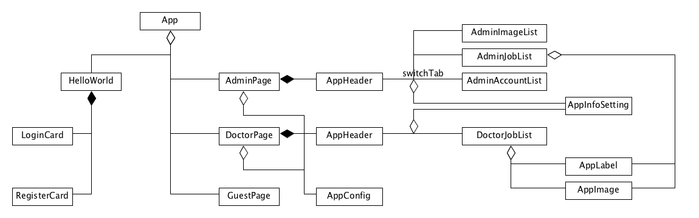

# 设计文档

`15331335`

## 技术选型

前端采用的技术栈如下：

- Vue：一种渐进式 MVVM 框架，简单轻量，易快速上手。
- element-ui：根据 Vue 框架实现的 UI 框架。
- vue-resource：网络数据资源请求的工具库。
- CamanJS：前端图像处理的 JavaScript 库。
- Viewer.js：前端图像查看的 JavaScript 库。

## 架构设计

下面是开发的目录结构：

- **dist**：项目构建后的产品文件。
- **public**：入口 html 文件以及引入的 JavaScript 库
- **src**：项目的源代码，主要都在 components 里面进行开发。
  - assets
  - components

## 组件划分

下面是整体的架构图：

各个组件的逻辑如下：

- App：作为应用的主要入口，控制页面的条件渲染。
- HelloWorld：作为登录和注册的控制页面。
  - LoginCard：登录组件。
  - RegisterCard：注册组件。
- AppHeader：作为下面页面的 tab 跳转控制。
- AdminPage：包含四个 tabs。
  - AdminImageList
  - AdminJobList
  - AdminAccountList
  - AppInfoSetting：各类权限用户页面的复用组件，用于修改用户信息。
- DoctorPage：包含两个 tabs。
  - DoctorJobList
  - AppInfoSetting
- DoctorPage

其中对于 JobList 提供了对于单个 Job 的两个重要组件：

- **AppLabel**：用于控制标注信息。
- **AppImage**：包含图像查看和处理。

